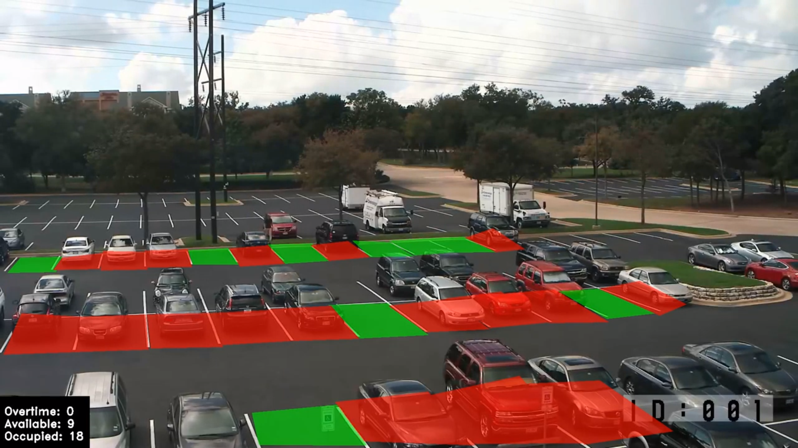

# Parking spot detection
Counting the number (and determining the location) of available spots on a parking lot is not as easy/viable as it might seem like. Knowing how many and which spots are free saves a lot of time and avoids frustration from customers, thus allowing for a better shopping −or any kind of activity− experience.

Traditional solutions such as in-ground sensors and overhead indicator sensors rely on lots of equipment which are heavily dependent on periodical maintenance sessions; naturally, these approaches will be costly. In contrast, detecting spot availability through cameras is not only cheaper, but provides more real-time feedback data since detection is done every 15 seconds for the whole parking lot. One potential major drawback is the detection will not always be 100% precise because it will throw out some false positives and/or false negatives.

Finally, I decided to also implement the "overtime" option, which means the camera will report any vehicle that has surpassed some kind of time threshold. This will result useful if there's a necessity to impose a time limit on the occupancy of said parking spots. Here's a demo showing how the system works:

[](https://www.youtube.com/watch?v=ZMRcPwIJ9bE)
## Flexibility
Although this project might seem quite specific, it can be easily modified to solve other types of problems, such as triggering alarms when a person is on a place he is not supposed to be (e.g. near a painting on an art exhibition).
## Requirements
- Apart from exporting the *spot.yml* environment, you're gonna need PostgreSQL along the PostGIS extension installed.
- Modify the username and password from the *config.ini* file under the *src* directory so it fits your needs.

## Implementation
1. *Initialization:* Select the regions of interest that will be later analyzed by the parking system. **Left click to select the corners and right click to initialize another parking spot.** Execute the *init.py* file for each installed camera.
```console
foo@bar:parking$ psql -U postgres -c "CREATE DATABASE parking_spot;"
foo@bar:parking$ python init.py path/to/video.mp4 camera_id "section camera_id"
```
2. *Detection:* Now that the system knows which regions are of interest, it can start reading from the video and update the database according to the ever-changing status of the parking spots (either available, occupied or overtime).
```console
foo@bar:parking$ python main.py path/to/video.mp4 camera_ids --time_interval --limit
```
**NOTE:** Since the parking system is designed to analyze different places, the video feed will not be shown. If you want to visually check the system works, then uncomment lines 72 and 73 from the *main.py* file and use a single camera id.

## Future work
The parking system's purpose is to analyze live feed videos, not prerecorded ones. I'll make the necessary changes once I'm able to get my hands into a couple of cameras.
